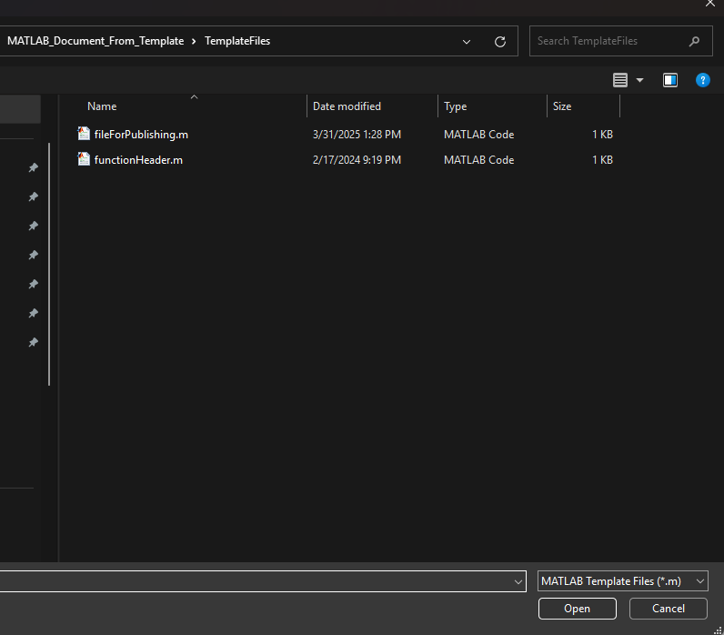
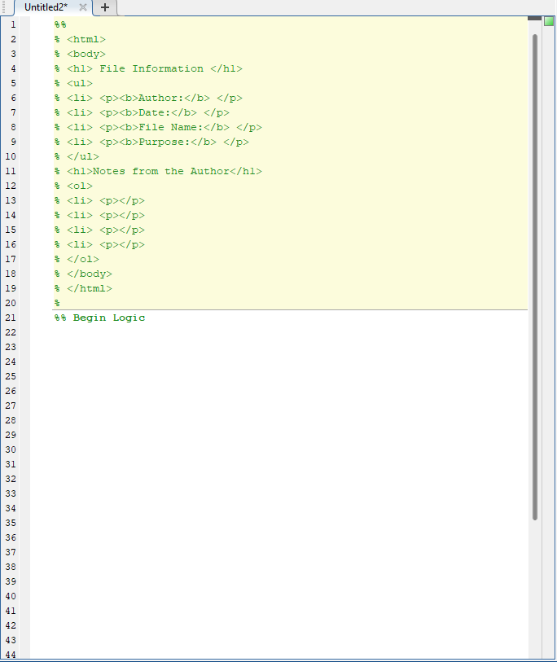
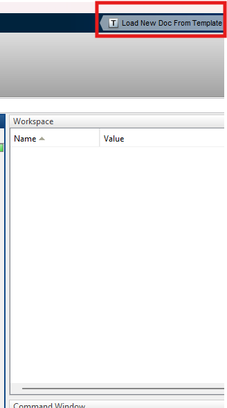

# Table of Contents
* [Setting Up the Tool](#setting-up-the-tool)
    * [Template Default Path](#template-default-path)
    * [Template File for Loading](#template-file-for-loading)
    * [Adding Template Picker as a Shortcut/Favorite](#adding-template-picker-as-a-shorcutfavorite)

* [Running the Tool](#running-the-tool)
    * [Running templatePicker.m Directly](#running-templatepickerm-directly)
    * [Adding Template Picker as a Shorcut/Favorite](#adding-template-picker-as-a-shorcutfavorite)

# Setting Up the Tool

## Template Default Path
The MATLAB Template Generator stores previous user default paths to the file storage directory in a file named default_path.txt. The default path for the tool is:

    /MATLAB_Document_From_Template/ApplicationToolBox/

The user can update the default path using the following call in MATLAB:

    pathToTemplate="<insert path to desired path here>";
    setupTemplateEnv(pathToTemplate);

The user is encouraged to put this function call in their startup.m file located in the **<u>userpath</u>** location. Once this is called, the path to the template storage directory will be stored in MATLAB's available environment variables. The variable name is:
    
    DEFAULT_MATLAB_TEMPLATE_PATH

## Template File for Loading
MATLAB Template Generator is able to create new files in the MATLAB editor using any **.m** file. Some example templates are provided for the user in

    /MATLAB_Document_From_Template/TemplateFiles/

The user is encouraged to make templates that contain markings, boilerplate, or headers that they use often.

## Adding Template Picker as a Shorcut/Favorite
MATLAB has the ability to add buttons to its GUI that can run logic that a user defines. Follow the steps below to add MATLAB Template Generator to your shortcuts.

1) In the MATLAB editor, navigate to 

    /MATLAB_Document_From_Template/ApplicationToolBox/
    
    and run **addShortcut.m**.
    
    **Note: Interacting with shortcuts directly wasn't added until MATLAB 2018a. This means that the tool works slightly differently depending on which MATLAB version is running the tool.**

2) If the tool is being ran in a MATLAB version prior to 2018a, the user will need to restart MATLAB.

# Running the Tool
There are two ways to run the tool. One way involves running the **templatePicker.m** directly while the other method involves using the shortcut created in the [Adding Template Picker as a Shorcut/Favorite Section](#adding-template-picker-as-a-shorcutfavorite).

## Running templatePicker.m Directly
TemplatePicker.m is located in 

    /MATLAB_Document_From_Template/ApplicationToolBox/templatePicker.m

Follow these steps to run the tool with templatePicker.m

1) Run templatePicker in the MATLAB command window. You should see the following window:

2)  Select the desired file. If the template default path was set, the GUI should be in that folder. The user should see a new file output with the new template format.

## Using Shortcuts/Favorites
Assuming the user set-up their shortcut for templatePicker.m, use the following steps to run the tool using the shortcut.

1) Click the "Load New Doc From Template shorcut button" 

2) Select the desired file from the file picker GUI.

**The user should see a new file output with the new template format.**

